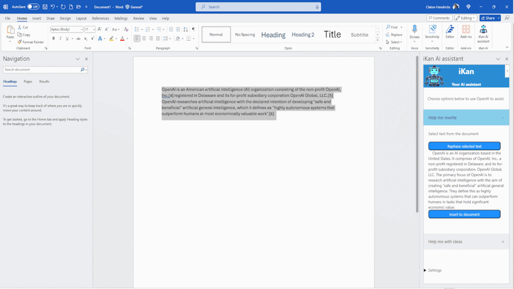

# iKan: Word Add-In for Document Refinement

**NOTE:** ==I am not activaly maintaining this project, feel free to contribute to the project==

## Introduction

Welcome to **iKan**, your ultimate Microsoft Word companion. Designed to elevate your document editing experience, _iKan_ offers state-of-the-art rewriting capabilities with the help of OpenAI GPT4.

## Features

- 🔧 **AI-Powered Rewriting**: Enhance your text to paraphrase phase the selected text..
- 🧙‍♂️ **Template Creation Wizard**: Craft templates tailored to your needs.
- 🌍 **Easy Integration**: Seamlessly embedded within Word's ecosystem.

## Installation
I am currently trying to publish this addin to the Office Addins store but untill then please follow the steps to side load the addin. Its a long painfull process 😞

1. Download iKan.xml file from the Releases page
2. Copy the .xml file to the folder and share it (I know it sounds weird). Once you share the folder, it will give you an network address e.g. \\foofighters\iKan 
3. Open Word - Options - Trust Center - Trust Center Settings - Trusted Addin-in Catalog
4. Under Trusted Catalogs  - Add the network path to the Catalog Url box and click on Add catalog. Click ok and restart Word
5. No you are not done yet (Phew!!!) - Open Word - new document or open an existing one
6. On the Home ribbon, Click on "Add-ins"  - "Get Addins". In the addin window, click on "Shared Folder" on the top and that is where you will see "iKan AI Assistant" - click on install and done. 

## Requirements

- Microsoft Word 2016 (Desktop) or newer.
- Make sure you go to OpenAI.com to get your API key 
- Active internet connection for AI features.

## Feedback

We welcome your feedback! Please raise any issues or suggestions on our [GitHub issue tracker](https://github.com/clatonhendricks/ikan/issues).

## License

This software is licensed under the MIT License. Refer to [LICENSE.md](LICENSE.md) for more details.

